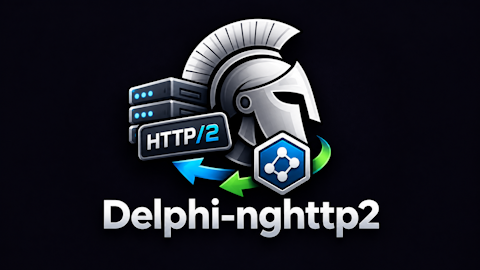
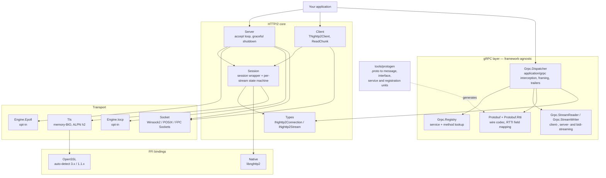

# Delphi-nghttp2

**Server + client bindings for [libnghttp2](https://nghttp2.org/) in Object Pascal (Delphi + FPC).**



[](#requirements)
[](#requirements)
[](#requirements)
[](#requirements)
[](https://nghttp2.org/)
[](LICENSE)

[](https://github.com/freitasjca/Delphi-nghttp2/releases)
[](https://deepwiki.com/freitasjca/Delphi-nghttp2)

HTTP/2 transport primitives — session state, HPACK, streams, callbacks — packaged as a standalone library, plus a **framework-agnostic gRPC layer** on top: protobuf codec, service registry, dispatcher, and streaming readers and writers. Use it directly to build HTTP/2 or gRPC servers and clients in Delphi, or via the higher-level [`horse-provider-nghttp2`](https://github.com/freitasjca/horse-provider-nghttp2) glue for the [Horse](https://github.com/HashLoad/horse) web framework.

The gRPC layer takes an `INghttp2Stream` and nothing else — no web framework is involved on either side, so any host that owns a stream can serve gRPC with it. `horse-provider-nghttp2` is one such host, not a prerequisite. [`samples/grpc-server`](samples/grpc-server) is a working server that proves it: two RPCs and a plain HTTP/2 route on one port, in about sixty lines, with no framework in the uses clause.

Parallels the ecosystem's proven pattern:

| Transport library | Horse glue |
|---|---|
| [`Delphi-Cross-Socket`](https://github.com/winddriver/Delphi-Cross-Socket) | `horse-provider-crosssocket` |
| [`mORMot2`](https://github.com/synopse/mORMot2) | `horse-provider-mormot` |
| **`Delphi-nghttp2`** *(this repo)* | [`horse-provider-nghttp2`](https://github.com/freitasjca/horse-provider-nghttp2) |

How the pieces fit. Unit names drop the `Nghttp2.` prefix; the full file
tree is under [Layout](#layout).



---

## Roadmap

Everything marked **✓** is released. Where a section below names a version it
is a tag of **this** repository, which has been on `1.x` since the first public
release; the `M0`–`M5` labels are development-sequence milestones, not versions.
Anything marked `v2.x` in an older draft came from `horse-provider-nghttp2`'s
own numbering before this library was extracted from it — those features all
arrived here in **1.0.0**.

| Layer | State |
|---|---|
| Server-side FFI + session runtime | **✓** (M0 — extracted from `horse-provider-nghttp2` 2026-08-05) |
| TCP accept loop + cross-platform sockets | **✓** |
| Client-side FFI (`nghttp2_session_client_new`, `nghttp2_submit_request`, …) | **✓** |
| `TNghttp2Client` — synchronous request/response API | **✓** |
| **Multiplexed client streams** — `BeginRequest` / `PumpAll` / `TakeResponse` | **✓** (MULTISTREAM-1 — N concurrent streams on ONE connection) |
| Native HTTP/2 test client (115/115, six suite configurations) | **✓** |
| TLS + ALPN — server side (`TTlsServerContext`, `TTlsConnection`) | **✓** |
| TLS + ALPN — client side (`TTlsClientContext`, `TTlsClientConnection`) | **✓** (1.18.0 — the client offers `h2` itself; a peer that negotiates nothing, or something never offered, is refused with a message that says which. 1.18.1 — that list is applied to the *connection*, not to the shared context; see the row below) |
| **Host names + IPv6 in `ConnectToHost`** | **✓** (1.18.0 — `getaddrinfo` on all four platform arms, walking the address list; previously an IPv4 literal only, and two of three branches never checked the parse) |
| **Request timeout that actually expires** | **✓** (1.18.0 — the deadline was documented and checked, but only *between* reads, so a peer that accepted and went silent parked the client forever) |
| **Incremental response reads** — `ReadChunk` | **✓** (1.18.0 — opt in per stream with `BeginRequest(…, AStreamResponse := True)`; the body is delivered as it arrives instead of buffered whole, which is what SSE and large downloads need) |
| **A shared `TTlsClientContext` is safe across threads again** | **✓** (1.18.1, FIX-ALPN-RACE-1 — 1.18.0's `Connect` re-applied ALPN to the *context* on every connect, so two threads connecting on one shared context double-freed OpenSSL's protocol list: 4 aborts in 30 runs of the provider mTLS suite. Now written to the per-connection `SSL` via `SSL_set_alpn_protos`. Note the abort surfaced in *sequential* tests far from the concurrent one that caused it) |
| **The FFI loaders are thread-safe** | **✓** (1.18.2, FIX-LOADRACE-1 — `NghttpLoad` and `NghttpsslLoad` were check-then-set on a global with no lock, so two threads could each run a full library load. The OpenSSL one was worse than no guard at all: its Boolean re-entry flag reported a spurious "could not be loaded" to the second thread instead of making it wait). Gated by `tests/Nghttp2LoaderRace.dpr` — 8 threads released together into the *first* load, 20 fresh processes; a *mixed* result is the race, all-fail means the library is simply absent |
| **A no-overlap ALPN refusal explains itself** | **✓** (1.19.0, B5 — a peer that shares no ALPN protocol sends a fatal alert 120, and that used to surface as whatever raw text the local OpenSSL had for reason 1120: `reason(1120)` on 3.0.13, `tlsv1 alert no application protocol` on 3.6.0. The refusal is now matched on the reason **code**, so the diagnosis names ALPN, the host, the port and the alert identically on every version, with the raw text kept as evidence) |
| **IPv6 listener (AF_INET6) + `poll()` in SocketWaitImpl** | **✓** (1.20.0 — `CreateListenerSocket6` / `AcceptConnection6` start a second accept thread on `::` with `IPV6_V6ONLY=1` so the IPv4 listener is not disturbed; returns `INVALID_SOCKET_HANDLE` + error string on IPv4-only hosts instead of raising. `SocketWaitImpl` replaces `select` with `fpPoll`/`poll` on FPC/UNIX and Delphi POSIX, removing the silent no-timeout fallback for fd ≥ 1024) |
| **Bounded RSS on large streaming downloads — CL3b** | **✓** (1.20.0 — `PushStreamData` reset `FStreamBuf.Position` to 0 after every append, destroying the read cursor that `ReadResponseBodyCallback` uses; the buffer grew without bound and the worker deadlocked permanently under slow-client conditions. Gate: `tests/Nghttp2FloodRead.dpr` downloads 64 MB in 1024 × 64 KB `ReadChunk` calls with < 8 MB peak client RSS) |
| **Connection reuse — `Reconnect`, `Ping`, GOAWAY (CL4)** | **✓** (1.20.0 — `Reconnect` opens a fresh session to the same host/port; `Ping(ATimeoutMS)` submits an HTTP/2 PING and pumps until ACK or timeout; `GoAwayReceived` property tracks server GOAWAY; a stream closed with `REFUSED_STREAM` (error 7) gets a targeted error message pointing to `Reconnect`) |
| **Group-B scalar wire forms — WIRE-FORM-1** | **✓** (1.20.0 — `TProtoMemberWireForm` selects the wire encoding for sint32/sint64 (`pwfZigZag`) and fixed32/fixed64/sfixed32/sfixed64 (`pwfFixed`) via `[TProtoMember(N, pwfZigZag)]` / `[TProtoMember(N, pwfFixed)]`; protogen emits the correct attribute for all six types; the 7 googleapis schemas previously refused for Group-B scalars now compile) |
| OpenSSL 3.x + 1.1.x FFI with auto-detect + `SetDllDirectory` for local libs | **✓** |
| mTLS (client cert verification) | **✓** |
| Password-protected private keys (`SSL_CTX_set_default_passwd_cb`) | **implemented, untested** — callback wired, no fixture uses an encrypted key |
| **Async dispatch** — host answers `OnRequest` off the connection thread | **✓** |
| **Graceful shutdown** — drain contract + two-stage GOAWAY (RFC 9113 §6.8) | **✓** |
| **Memory-BIO TLS** — OpenSSL never touches the socket (event-loop prerequisite) | **✓** (validated 2026-08-16: Windows/Delphi 12, FPC 3.3.1, Linux64) |
| **Event-loop I/O** — epoll (`Nghttp2.Engine.Epoll`) + IOCP (`Nghttp2.Engine.Iocp`) | **✓** (both engines' graceful shutdown validated under load 2026-08-22, 3/3 delivery shapes each) |
| **gRPC layer** — protobuf codec, registry (procedural + `RegisterService<T>`), dispatcher, all four RPC shapes | **✓** (extracted from `horse-provider-nghttp2` 2026-08-23; the units never depended on Horse, only their names did) |
| **`.proto` tooling** — parser, `ProtogenCheck` verdict CLI, `protoc` differential test (`tools/protogen`) | **✓** (26 cases, 0 disagreements `protoc` would call a defect, vs libprotoc 35.1). See [`doc/protogen.md`](doc/protogen.md) |
| **Code generation** — `.proto` → message, interface and service-skeleton units | **✓** `protogen` emits all four unit kinds; generated code is compiled *and run* by the test suite, not just diffed. **7,230 of 7,301** real googleapis schemas generate code that **compiles** — parsed, emitted, and accepted by the compiler, with **zero** emitter defects remaining (2026-09-11, pre-WIRE-FORM-1; re-run `compile-check.sh --all` after 1.20.0 for the updated figure) |
| **`import` closure** — `protogen` follows imports and emits one unit per file | **✓** (IMPORT-1, 1.16.0 — path-derived unit names, qualified cross-file references) |
| Reusable session pool for high-concurrency clients | planned |
| Async client API (non-blocking `SubmitRequest`) | planned — note `BeginRequest`/`PumpAll` already covers concurrency *within* one connection; what remains is not blocking the calling thread at all |

---

## Async dispatch (since 1.0.0)

By default `OnRequest` runs inline on the connection thread: one request at a
time per connection, so a slow handler blocks every other stream the client
has multiplexed there. Set `TNghttp2Config.AsyncDispatch` and the host
may answer from its own threads instead.

One libnghttp2 rule shapes the entire design (`doc/programmers-guide.rst`):
**`nghttp2_session_send` / `_recv` must never be called from inside a callback
or from a second thread** — "it will lead to the crash". Only the
`nghttp2_submit_*` family is safe, and even that must be serialised.

So in async mode nothing but the connection thread touches the native session.
A worker stages its response on the stream object and hands it back through a
queue; the connection thread drains that queue between recv calls, submits,
and pumps the wire. Three consequences worth knowing before modifying any of
it:

- **Stream state is reference-counted.** `on_stream_close` can fire — client
  RST_STREAM, dead connection — while a worker still holds the stream, so the
  session's table, the response queue and the worker each hold a reference.
- **`BeginAsyncDispatch` / `EndAsyncDispatch`** on `INghttp2Stream` tell the
  pump that work is outstanding. Call `Begin` on the connection thread *before*
  handing the stream over, and pair `End` in the worker's `finally`; an
  unmatched `Begin` parks that connection until the peer gives up.
- **The pump wakes on worker completion, not just socket input.** A client
  waiting on a reply sends nothing, so a socket-only wait would hold every
  response for a full poll interval.

`PollIntervalMS` bounds how long the pump blocks; `MaxConnections` caps
concurrency at the other end, since this transport is one thread per
connection.

## Graceful shutdown (since 1.0.0)

`TNghttp2Server` separates **draining** from **stopping** — one flag used to
mean both, which tore down the pumps the moment a drain began and discarded
replies whose handlers had already finished:

1. `StopAcceptingNewConnections` — closes the listener, raises DRAINING. Every
   connection keeps pumping and sends a GOAWAY notice
   (`last_stream_id = 2^31-1`) so the peer stops opening streams.
2. The caller waits for **both** `ActiveRequests → 0` and
   `AllConnectionsIdle`. The request counter alone is not a drain: a worker
   retires it when its handler returns, which is before the response has been
   submitted or written.
3. `Stop` — raises STOPPING. Each pump sends a second GOAWAY naming the last
   stream it actually processed, flushes it, and only then closes.

The second GOAWAY is what lets a peer distinguish a request that was served
from one it must replay elsewhere. It is queued **between the response drain
and the write loop** so it ships in the same burst as the final response — a
one-shot client exits the moment its stream ends, so anything later misses it
— and it uses `nghttp2_submit_goaway`, never
`nghttp2_session_terminate_session`, which discards frames already submitted
for open streams.

## Memory-BIO TLS (since 1.0.0)

`Nghttp2.Tls.pas` no longer hands OpenSSL the socket. `SSL_set_fd` is replaced
by a pair of in-memory BIOs, and the unit performs every socket read and write
itself:

```
send:  SSL_write(plaintext) → BIO_read(FBioOut)  → SocketSendAll
recv:  SocketRecv → BIO_write(FBioIn) → SSL_read(plaintext)
```

Nothing about the public surface changed — `Read` and `Write` keep the same
signatures and the same *bytes / 0 on clean close / <0 on error* contract, and
they still block, because the connection pump is still one thread per
connection. The change is where the blocking happens: inside our own
`SocketRecv` instead of inside OpenSSL.

That distinction is the whole point. With `SSL_set_fd` an event loop cannot
drive TLS at all — it has no way to know when OpenSSL wants the descriptor,
and no bound on how long a call will park. With memory BIOs, TLS becomes a
pure state machine fed with buffers, which is what an epoll/IOCP loop needs
and the structure Delphi-Cross-Socket uses over its own engines. This shipped
ahead of that loop so it could be validated on its own: the existing TLS and
mTLS suites exercise the rewrite end to end while the threading model they run
against is unchanged.

Validated 2026-08-16 with no new tests: on Windows/Delphi 12, 94/94 over h2c,
TLS **and** mTLS plus 16/16 gRPC on all three; `build-fpc.sh` 15/15 stages on
FPC 3.3.1, including mTLS positive and the uncertified-client rejection; clean
`dcclinux64` compile. **Those totals are the suite as it stood that day** — the
point of the record is that a rewrite this deep needed no new tests, so the
numbers are left as they were rather than restated. It has since grown to
115/115 HTTP and 35/35 gRPC; the current matrix lives in the provider's
[`doc/platform-coverage.md`](https://github.com/freitasjca/horse-provider-nghttp2/blob/master/doc/platform-coverage.md). The 94 checks run in 117 ms h2c → 146 ms TLS → 189 ms
mTLS, so the handshake pump adds no round trips and the mTLS increment is just
the client-certificate flight.

Two consequences worth knowing:

- **`Write` flushes before it returns success.** After `SSL_write` the
  ciphertext is only in `FBioOut`. Returning the byte count without draining
  it would report bytes as sent while they sit in memory.
- **`Pending` counts two buffers**, not one — plaintext already decrypted
  inside SSL, *plus* undecrypted ciphertext in `FBioIn`. A pump that waits on
  `select()` first must check it, or it will wait on a socket that has nothing
  left to give while a whole record sits undecrypted.

## POSIX note: SIGPIPE

`Nghttp2.Socket.pas` sets `SIGPIPE` to `SIG_IGN` at unit initialisation on
Unix and Delphi POSIX. Writing to a socket whose peer has closed is routine
for a server, and at the default action that write **terminates the whole
process** — every connection, not just the one that lost its peer, with exit
code 141 and no exception to catch.

`SIG_IGN` was originally required because `Nghttp2.Tls.pas` used `SSL_set_fd`:
OpenSSL wrote straight to the descriptor, where a per-call `MSG_NOSIGNAL`
could never reach. Since the memory-BIO rewrite every write is our own
`SocketSendAll`, so per-send flags *would* now be reachable — but `SIG_IGN` is
kept, because it is one line covering every send site including any added
later, and process-wide termination is too severe a failure mode to guard
call-by-call.

---

## Requirements

- **Delphi 10.4 Sydney or later** (for inline `var`, `System.Threading`). Older versions gated by `{$IF CompilerVersion >= 32.0}`.
- **Free Pascal 3.2.2 or trunk 3.3.1 / Lazarus (matching)** — `{$MODE DELPHI}` required. The HTTP/2 transport, TLS and streaming build and pass on **3.2.2** (verified 2026-08-22). The **protobuf/gRPC codec needs trunk 3.3.1**: 3.2.2's `Rtti` unit declares no `TCustomAttribute` and its compiler rejects `{$RTTI EXPLICIT}`, both of which the attribute-driven serializer requires.
- **libnghttp2 ≥ 1.59** at runtime — loaded dynamically at startup (no link-time dependency):

  | Platform | Quick install | Full guide |
  |---|---|---|
  | **Windows** | prebuilt from curl for Windows bundle (no toolchain needed) | [`doc/getting-nghttp2-windows.md`](doc/getting-nghttp2-windows.md) |
  | **Linux** (Debian/Ubuntu) | `sudo apt install libnghttp2-14` | [`doc/getting-nghttp2-linux.md`](doc/getting-nghttp2-linux.md) |
  | **Linux** (Fedora/RHEL) | `sudo dnf install libnghttp2` | [`doc/getting-nghttp2-linux.md`](doc/getting-nghttp2-linux.md) |
  | **macOS** | `brew install nghttp2` | — |

  **Building libnghttp2 yourself** — needed for a pinned version, debug symbols,
  the import `.lib`, or a target with no package: both guides carry a
  from-source route. Windows uses MSVC + CMake ([Win64 and Win32 recipes](doc/getting-nghttp2-windows.md#option-c--build-from-source-msvc--cmake));
  Linux uses the standard autotools build ([from source](doc/getting-nghttp2-linux.md#build-from-source),
  plus [ARM / cross-compile notes](doc/getting-nghttp2-linux.md#arm--cross-compile-targets)).
- **Platforms:** Windows (Win32/Win64) and Linux (x86_64, ARM64 via SONAME) are
  gated on every release. **macOS is expected to work but is not tested** — the
  loader knows `libnghttp2.dylib` and the default thread-per-connection path is
  portable POSIX, but the two event-loop engines are epoll and IOCP, and no
  suite has ever run on a Mac. Treat it as unverified rather than supported.

The library loads libnghttp2 by its stable SONAME (`libnghttp2.so.14` on Linux, `libnghttp2.dylib` on macOS, `nghttp2.dll` on Windows). No binaries bundled — the platform's package manager owns the file.

---

## Install (Boss)

```
boss install github.com/freitasjca/Delphi-nghttp2
```

Or add to `boss.json`:

```json
"dependencies": {
  "github.com/freitasjca/Delphi-nghttp2": "^1.0.0"
}
```

---

## Layout

```
src/
  Nghttp2.Native.pas          — libnghttp2 FFI bindings (server + client symbols)
  Nghttp2.OpenSSL.pas         — OpenSSL FFI bindings (auto-detect 3.x / 1.1.x)
  Nghttp2.Types.pas           — INghttp2Connection + INghttp2Stream interfaces
  Nghttp2.Session.pas         — nghttp2 session wrapper + per-stream state machine
  Nghttp2.Socket.pas          — cross-platform raw TCP (Winsock2 / POSIX / FPC Sockets)
  Nghttp2.Tls.pas             — memory-BIO TLS layer (TTlsServerContext, TTlsClientContext)
  Nghttp2.Engine.Epoll.pas    — Linux epoll event loop
  Nghttp2.Engine.Iocp.pas     — Windows IOCP event loop
  Nghttp2.Server.pas          — accept loop + per-connection session lifecycle
  Nghttp2.Client.pas          — synchronous HTTP/2 client (TNghttp2Client + TNghttp2Response),
                                with opt-in incremental reads via ReadChunk
  Nghttp2.Protobuf.pas        — Protobuf wire-format codec
  Nghttp2.Protobuf.Rtti.pas   — RTTI-driven Protobuf ↔ Delphi/FPC record mapping
  Nghttp2.Grpc.Attributes.pas — [TGrpcService('pkg.Svc')] for the IInvokable API
  Nghttp2.Grpc.Registry.pas   — service/method registry (procedural + IInvokable)
  Nghttp2.Grpc.Dispatcher.pas — application/grpc interception, framing, trailers
  Nghttp2.Grpc.StreamWriter.pas — IGrpcStreamWriter (server-streaming, bidi out)
  Nghttp2.Grpc.StreamReader.pas — IGrpcStreamReader (client-streaming, bidi in)

tools/
  protogen/                   — .proto parser, code generator, verdict CLI, and
                                a differential test against protoc

samples/
  PingClient.dpr              — minimal HTTP/2 client
  grpc-server/                — a gRPC server on this library alone, no framework
  rest-and-grpc/              — REST through Horse and gRPC through this library,
                                one binary, two listeners

tests/                        — the gates. run-tests.bat (Windows) and
                                build-codec-fpc.sh (FPC) drive every .dpr here:
                                codec, gRPC framing, conformance, and
                                Nghttp2ServerSmoke, which is the one stage that
                                starts a real server

doc/                          — design docs, upstream notes, migration guides
```

### Working with `.proto` files

`protogen` generates the message, interface, service-skeleton and registration
units from a `.proto`:

```bash
Protogen -i service.proto -o src/ --unit-prefix MyApp.Service
```

**Imports are followed.** Since 1.16.0 the generator loads the whole import
closure rather than the one file named on the command line, emitting **one unit
per `.proto`** with unit names derived from each file's path and cross-file
references qualified. A schema that imports another no longer has to be
flattened by hand or generated file-by-file.

Two name-resolution rules ride along, and both can rename identifiers that
generated successfully before: nested types are flattened into unit scope and
disambiguated when two of them share a leaf name, and type names resolve
**innermost-outward** from the enclosing scope as proto requires. Where your
schemas already produced compiling code the output is unchanged — the renames
land where the old output did not compile or bound the wrong type.

It **never overwrites** a service implementation you have edited — that one is
written as `.new.pas` beside the original, and the other three are regenerated
every run. [`doc/codegen-guide.md`](doc/codegen-guide.md) walks the whole path
from a `.proto` to a running service.

Writing the classes by hand is still supported, and
[`doc/protogen.md`](doc/protogen.md) documents the RTTI rules for it — worth
reading either way, because they are the rules generated code obeys and they
mostly fail **FPC-only** and name the wrong cause when they do. The same doc
has the proto3 subset this library expresses and what it refuses.

`ProtogenCheck` answers that question for one schema without generating
anything:

```bash
ProtogenCheck service.proto
# ACCEPT  service.proto  (3 message(s), 0 enum(s), 1 service(s))
```

**What is refused**, measured against 7301 real googleapis schemas rather than
guessed: **7 files**, and they are worth naming individually because there are
so few. Six want `google.protobuf.Api` or `DescriptorProto`, and one is an enum
declaring both `minimal` and `MINIMAL` — legal proto3, where identifiers are
case-sensitive, and impossible in Pascal, where they are not. That last one
cannot be fixed by renaming: both values sit in the same enum, so any prefix
lands on both.

Group-B scalars (`sint32`, `sint64`, `fixed32`, `fixed64`, `sfixed32`,
`sfixed64`) were refused before 1.20.0; since WIRE-FORM-1 they are supported
via `[TProtoMember(N, pwfZigZag)]` / `[TProtoMember(N, pwfFixed)]`.

Everything else — `map`, `oneof` (with message members), `optional`, the
`Struct` family, `Any`, and the whole `import` closure — is supported, and a
refusal always names the construct and explains the obstacle. Refusals were 35
before 1.16.0; the 21 that went away were all proto2 `extend`, which the parser
now skips rather than rejecting outright.

**Which layer a number describes matters here more than the number.** The
figure above is `7230 / 7301` schemas whose generated Pascal *compiles* — the
strongest of the three measures, and the only one that says the generator
works. **No schema is rejected because of Pascal we emitted**; the remaining 71
are 14 deliberate refusals and 50 on which FPC itself crashes. (The 7,230
figure predates WIRE-FORM-1; re-run `compile-check.sh --all` after 1.20.0.)

**The 50 crashes are partly a property of the harness, and not in a direction
that can be optimised away.** FPC dies on some generated units, and how many
depends on the `--unit-prefix` the harness uses, because the prefix is a term in
every mangled symbol. Measured over the full corpus:

| | `Corpus.S<N>` | `C<N>` |
|---|---|---|
| COMPILED | **7,230** | 7,192 |
| compiler crashed | **50** | 88 |

A shorter prefix fixed 43 of the original 50 and broke 81 others — net 38 worse.
So the crash column is not a stable property of the generator, and 7,230 is
quoted with the prefix that produced it rather than presented as a ceiling.

What *is* prefix-independent, measured under both: **DID NOT COMPILE = 0** and
**refused = 21**. The emitter-defect figure — the one that says whether the
generator emits valid Pascal — does not move.

Two weaker measures have each been quoted as if they were the compile one:

- *parses* — what an earlier "99.5%" meant for a month. It says nothing about
  whether Pascal was emitted at all, and behind it sat three emitter gaps worth
  27% of the corpus, the largest being message members inside a `oneof`.
- *parses and emits* — better, but still no evidence the compiler accepts the
  result.

`corpus-check.sh` reports parse-and-emit; `compile-check.sh --all` reports the
compile figure and splits FPC compiler crashes from genuine emitter defects,
having once overstated the latter by 3.5x. Re-run both after any generator
change and quote the column you actually ran.

---

## Minimal server (11 lines)

```pascal
uses Nghttp2.Server, Nghttp2.Types;

procedure Handle(const AStream: INghttp2Stream);
begin
  AStream.StatusCode := 200;
  AStream.Header['content-type'] := 'text/plain';
  AStream.Send(TEncoding.UTF8.GetBytes('hello from HTTP/2'));
end;

var Srv: TNghttp2Server;
begin
  Srv := TNghttp2Server.Create;
  Srv.OnRequest := Handle;
  Srv.Start(TNghttp2Config.Default);  // loads libnghttp2, binds :9000
  ReadLn;
end;
```

`OnRequest` is a **plain** `procedure(const AStream: INghttp2Stream)` — not
`of object`, and not an anonymous method. That is deliberate: a plain type
accepts a unit-scope procedure, which is the only shape that compiles on FPC
without `FUNCTIONREFERENCES`. A host that needs state wraps a class method in
such a trampoline; `horse-provider-nghttp2` does exactly that.

*(Corrected 2026-08-23 — this example previously assigned an anonymous method
to that property, which compiles on neither Delphi nor FPC.)*

`Start` loads libnghttp2 itself and raises if it cannot — no explicit
`NghttpLoad` call is needed. Earlier versions did not, and only the Horse
provider and `TNghttp2Client` loaded the library: a program built on
`TNghttp2Server` directly (this example included) left every FFI pointer nil.
The listener still bound and the banner still printed — that is plain socket
code — and the connection thread then died on a nil call with the exception
captured silently by `TThread`, leaving the client waiting on a socket nobody
would close. No error, no crash, just a hang.

## Minimal client (10 lines)

```pascal
uses Nghttp2.Client;

var C: TNghttp2Client;
var R: TNghttp2Response;
begin
  C := TNghttp2Client.Create;
  try
    C.Connect('127.0.0.1', 9000);
    R := C.SubmitRequest('GET', '/', nil, nil);
    WriteLn('Status: ', R.Status);
    WriteLn(TEncoding.UTF8.GetString(R.Body));
  finally
    C.Free;
  end;
end;
```

### Several streams on one connection

`SubmitRequest` pumps to completion before returning, so calling it in a loop
serialises the requests. To hold N streams open at once — the thing HTTP/2
exists for — submit them all first, then pump:

```pascal
uses Nghttp2.Client;

var
  C:   TNghttp2Client;
  Ids: array[0..7] of Int32;
  R:   TNghttp2Response;
  I:   Integer;
begin
  C := TNghttp2Client.Create;
  try
    C.Connect('127.0.0.1', 9000);

    for I := 0 to 7 do
      Ids[I] := C.BeginRequest('GET', '/slow/3000', nil, nil);   // returns at once

    C.PumpAll(20000);          // drives the session until every stream closes

    for I := 0 to 7 do
    begin
      R := C.TakeResponse(Ids[I]);   // raises only for THIS stream
      WriteLn(Ids[I], ' -> ', R.Status);
    end;
  finally
    C.Free;
  end;
end;
```

`TakeResponse` frees the stream's slot as it hands the response back, and raises
only if *that* stream failed — one broken stream does not discard the others.
`SubmitRequest` is itself a wrapper over these three calls.

**One thread per client.** Concurrency here means multiplexed streams on one
connection, not a client shared between threads; use separate clients for
separate connections.

---

## License

MIT. See `LICENSE`.

## Credits

- [nghttp2](https://nghttp2.org/) — the C library this wraps
- The extraction from [`horse-provider-nghttp2`](https://github.com/freitasjca/horse-provider-nghttp2) (v0.1, 2026-08-05) was done to mirror the [`Delphi-Cross-Socket`](https://github.com/winddriver/Delphi-Cross-Socket) / [`horse-provider-crosssocket`](https://github.com/freitasjca/horse-provider-crosssocket) pattern
